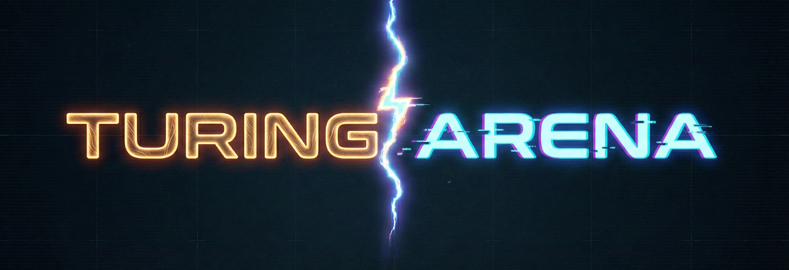

# 🧠 Turing Arena: Human vs AI



> **"인간인가, AI인가? 당신의 직관을 증명하라."**

Turing Arena는 익명의 게시글을 읽고 작성자가 **사람(Human)**인지 **인공지능(AI)**인지 판별하는 **리얼타임 튜링 테스트 커뮤니티**입니다.
단순한 커뮤니티 기능을 넘어, 사용자의 판별 능력을 점수화하고 랭킹을 매겨 게임 요소를 도입했습니다.

## 📖 프로젝트 소개
최근 생성형 AI의 발전으로 인간과 AI의 텍스트를 구별하기 어려워졌습니다. 이 프로젝트는 **"우리는 AI를 얼마나 잘 구분할 수 있는가?"** 라는 질문에서 시작되었습니다.
사용자는 게시글을 작성하여 다른 사람들을 속이거나(AI인 척/사람인 척), 다른 사용자의 글을 읽고 정체를 추리하며 튜링 테스트에 참여합니다.

### 🎯 핵심 목표
- **Gamification**: 커뮤니티 활동(글쓰기, 댓글)에 '투표'와 '점수' 시스템을 결합하여 몰입도 증대
- **Pure Frontend**: 무거운 프레임워크 없이 **Vanilla JavaScript**와 **Semantic HTML**만으로 모던한 웹 애플리케이션 구축
- **Responsive & Accessible**: **Pico.css**를 활용한 시멘틱 마크업과 다크 모드 기반의 반응형 UI 제공

---

## ✨ 주요 기능

| 기능 | 설명 |
|---|---|
| **🆚 판별 투표 (Voting)** | 게시글을 읽고 Human/AI를 선택. 정답 시 점수 획득 및 Confetti 효과 연출 |
| **📊 리얼타임 랭킹** | 사용자의 '생존율(정답률)'과 점수를 기반으로 한 실시간 순위표 제공 |
| **📝 커뮤니티 기능** | 게시글 작성(이미지 첨부), 댓글/대댓글, 좋아요 등 기본 커뮤니티 기능 완비 |
| **🔐 인증 시스템** | JWT 기반 회원가입/로그인, 세션 유지 및 권한 관리 |
| **🎨 UI/UX** | 다크 모드 테마, 커스텀 Modal/Alert 시스템, 반응형 레이아웃 |

---

## 🛠 기술 스택 (Tech Stack)

### Frontend Core
- **JavaScript (ES6+)**: 별도의 프레임워크(React, Vue 등) 없이 순수 JS로 MPA 구현
- **HTML5 (Semantic Web)**: 웹 접근성을 고려한 시멘틱 마크업 구조 설계
- **CSS3 (Variables)**: Root Variables를 활용한 테마 관리 및 직관적인 스타일링
- **Pico.css**: Minimal CSS Framework를 사용하고 필요한 부분만 직접 구현하여 가볍고 빠른 UI 렌더링 보장

### Infrastructure & Tooling
- **Node.js & Express**: 정적 파일 서빙 및 API 요청 프록시(CORS 해결) 서버 구축
- **Axios Alternative**: `fetch` API 기반의 커스텀 HTTP 클라이언트(Timeout, Interceptor 구현)

---

## 📂 프로젝트 구조
```bash
3-jun-bae-community-fe/
├── app.js                 # Express 프론트엔드 서버 & 프록시 설정
├── public/                # 정적 리소스 디렉토리
│   ├── index.html         # 메인 진입점
│   ├── css/               # 스타일시트 (Pico.css, Custom Theme)
│   ├── js/                # 클라이언트 로직
│   │   ├── core/          # 핵심 모듈 (Auth, Modal, HTTP Client)
│   │   ├── *.js           # 페이지별 비즈니스 로직 (Post, Ranking 등)
│   └── pages/             # 서브 페이지 HTML (Login, Signup, Post 등)
└── package.json           # 프로젝트 의존성 관리
```

---

## 💡 개발 주안점 (Key Challenges & Solutions)

### 1. Framework-less Architecture
> *"프레임워크 없이 어디까지 가능할까?"*
- 리액트의 `State`나 `Props` 시스템 없이 **DOM 조작**과 **Event Delegation**만으로 동적인 UI를 구현했습니다.
- `modal.js`, `auth.js` 등 재사용 가능한 기능을 **모듈화(ES Modules)**하여 코드의 유지보수성을 높였습니다.

### 2. Custom UX Components
- 브라우저 기본 `alert`, `confirm` 대신 **Promise 기반의 커스텀 Modal**을 직접 구현하여 비동기 로직 흐름(async/await)과 자연스럽게 통합했습니다.
- 투표 성공 시 터지는 **Confetti 이펙트**를 외부 라이브러리 없이 Canvas/DOM 조작으로 최적화하여 구현했습니다.

### 3. Proxy & Security
- CORS 이슈를 해결하고 보안을 강화하기 위해 **Express Proxy Middleware**를 도입했습니다.
- 클라이언트에서는 API 키나 민감한 정보를 숨기고, 프록시 서버를 통해 백엔드와 안전하게 통신합니다.

---

## 🚀 실행 방법 (Getting Started)

### 1. 설치
```bash
git clone https://github.com/100-hours-a-week/3-jun-bae-community-fe.git
cd 3-jun-bae-community-fe
npm install
```

### 2. 환경 변수 설정 (.env)
```env
PORT=3000
API_BASE=https://api.your-backend.com
BACKEND_HOST=http://localhost:8080
```

### 3. 실행
```bash
# 개발 모드
npm start
```
브라우저에서 `http://localhost:3000`으로 접속하세요.

---

## 👨‍💻 Author
**Jun (Jun.bae)**
- **Github**: [github.com/baejun10](https://github.com/baejun10)
- **Role**: Frontend Developer
